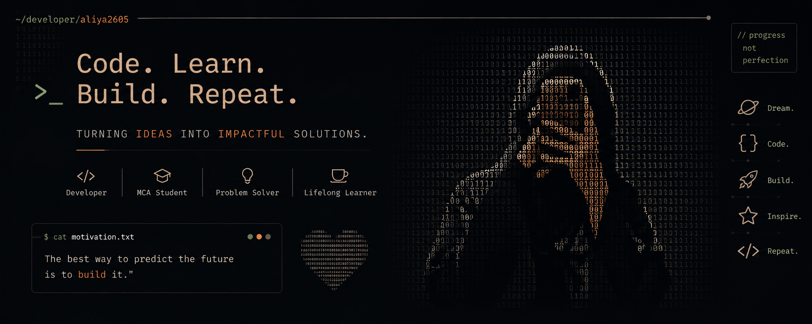

<p align="center">
  
</p>

<div align="center">

```text
$ whoami
Aliya Banu

$ role
Developer | MCA Student | Problem Solver

$ currently
Learning. Building. Improving.
```

### `Code. Learn. Build. Repeat.`
*Turning ideas into impactful solutions.*

</div>

<br/>

<!-- ============================ ABOUT ME ============================ -->

## `> about_me`

```yaml
name: "Aliya Banu"
role: "Developer, MCA Student, Problem Solver, Lifelong Learner"
```

I am an MCA student and aspiring software developer passionate about building meaningful, user-friendly applications and continuously improving my problem-solving skills. I enjoy learning new technologies, exploring different areas of software development, and turning ideas into real projects.

- 🎓 MCA Student
- 💻 Aspiring Software Developer
- 🧠 Currently improving problem-solving and DSA skills
- 🌱 Exploring new technologies
- 🚀 Building projects and learning through practice
- 🎯 Interested in creating useful and user-friendly applications

<br/>

<!-- ============================ TECH STACK ============================ -->

## `$ cat tech_stack.md`

**Languages**

<p align="left">
  
</p>

**Frontend**

<p align="left">
  
</p>

**Backend**

<p align="left">
  
</p>

**Database**

<p align="left">
  
</p>

**Tools**

<p align="left">
  
</p>

<br/>

<!-- ============================ PROJECTS ============================ -->

## `> featured_projects`

<table>
<tr>
<td width="50%" valign="top">

### 🔒 LeakGuard
Intelligent data leak prevention system built with a Chrome extension, React dashboard, Node.js, Express.js, and database integration.

<!-- Replace with your repo link -->
**Repo:** [REPLACE_WITH_LEAKGUARD_LINK](#)

</td>
<td width="50%" valign="top">

### 💊 PharmaStock
Collaborative academic project for pharmacy/medicine stock management.

<!-- Replace with your repo link -->
**Repo:** [REPLACE_WITH_PHARMASTOCK_LINK](#)

</td>
</tr>
<tr>
<td width="50%" valign="top">

### 🗑️ EasyBin — SmartWaste
IoT-based smart waste management system (MCA academic project) that monitors bin fill levels using ultrasonic sensors and cloud services.

<!-- Replace with your repo link -->
**Repo:** [REPLACE_WITH_EASYBIN_LINK](#)

</td>
<td width="50%" valign="top">

### 🎨 BloomCanvas
A Canva-inspired web application for creating aesthetic designs with drag-and-drop elements, styled text, and dynamic backgrounds.

<!-- Replace with your repo link -->
**Repo:** [REPLACE_WITH_BLOOMCANVAS_LINK](#)

</td>
</tr>
</table>

<br/>

<!-- ============================ CURRENTLY LEARNING ============================ -->

## `$ cat currently_learning.md`

```text
[■■■■■■□□□□] Data Structures & Algorithms
[■■■■■□□□□□] Problem Solving
[■■■■■■□□□□] Java Development
[■■■■□□□□□□] Full Stack Development
[■■■□□□□□□□] Android Development
[■■□□□□□□□□] Machine Learning Fundamentals
```

<br/>

<!-- ============================ CODING PROFILES ============================ -->

## `> connect`

<p align="left">
  <a href="https://leetcode.com/u/Aliya26/" target="_blank">
    
  </a>
  <a href="https://www.linkedin.com/in/aliya-banu26/" target="_blank">
    
  </a>
  <a href="https://github.com/aliya2605" target="_blank">
    
  </a>
</p>

<br/>

<!-- ============================ GITHUB STATS ============================ -->

## `$ ./github_stats.sh`

<p align="center">
  
  
</p>

<p align="center">
  
</p>

<br/>

<!-- ============================ MOTIVATION ============================ -->

<div align="center">

```text
$ cat motivation.txt

"The best way to predict the future
 is to build it."
```

</div>

<br/>

<!-- ============================ FOOTER ============================ -->

<div align="center">

```text
> progress, not perfection.
```

### `Code. Learn. Build. Repeat.`

<!-- Optional: uncomment if you want a subtle visitor counter -->
<!--

-->

</div>
