<!-- =========================================================
     ALIYA BANU | GITHUB PROFILE README
     THEME: ORANGE + BLACK
     Save your banner as: assets/github-banner.png
========================================================= -->

<p align="center">
  
</p>

<p align="center">
  
</p>

<p align="center">
  
  
  
</p>

<p align="center">
  <a href="https://leetcode.com/u/Aliya26/">
    
  </a>
  <a href="https://www.linkedin.com/in/aliya-banu26/">
    
  </a>
</p>

---

## 🟠 `whoami.exe`

```text
╭──────────────────────────────────────────────────────────────╮
│  👩🏻‍💻  name    → Aliya Banu                                 │
│  🎓  role    → MCA Student + Aspiring Developer             │
│  🧠  focus   → Problem Solving + DSA                        │
│  🚀  status  → Learning. Building. Improving.               │
│  ☕  runtime → powered by curiosity and coffee              │
╰──────────────────────────────────────────────────────────────╯
```

> `Turning ideas into impactful solutions — one commit at a time.`

---

## 🧡 `tech_stack.init()`

<p align="center">
  
</p>

<p align="center">
  
</p>

<p align="center">
  <code>learn → practice → build → improve → repeat</code>
</p>

---

## 🎮 `current_quest.exe`

```text
╔══════════════════════════════════════════════════════════════╗
║                    🎯  CURRENTLY LEVELING UP                ║
╠══════════════════════════════════════════════════════════════╣
║  [01]  Data Structures & Algorithms                          ║
║  [02]  Problem Solving                                       ║
║  [03]  Java Development                                      ║
║  [04]  Full Stack Development                                ║
║  [05]  Android Development                                   ║
║  [06]  Machine Learning Fundamentals                         ║
╚══════════════════════════════════════════════════════════════╝
```

<p align="center">
  
</p>

<p align="center">
  <i>no rush. no shortcuts. just consistent progress.</i>
</p>

---

## 🔥 `github.analytics()`

> These cards are generated inside this repository by GitHub Actions, so they don't depend on a public stats website loading every time.

<p align="center">
  
  
</p>

---

## 🐍 `snake_mode = ON`

<p align="center">
  
</p>

<p align="center">
  <sub>watching my contribution graph get eaten, one square at a time 🟠</sub>
</p>

---


<p align="center">
  
  
</p>

---

## 🔗 `establish_connection()`

<p align="center">
  <a href="https://leetcode.com/u/Aliya26/">
    
  </a>
  <a href="https://www.linkedin.com/in/aliya-banu26/">
    
  </a>
  <a href="https://github.com/aliya2605">
    
  </a>
</p>

---

## 💬 `motivation.txt`

```text
$ cat motivation.txt

"Start where you are.
Use what you have.
Build what you can."

$ echo $MINDSET

progress > perfection
consistency > intensity
learning > pretending to know everything
```

<p align="center">
  
</p>

<p align="center">
  <code>~/developer/aliya2605 $ exit</code>
  <br><br>
  🟠 🟠 🟠
</p>
